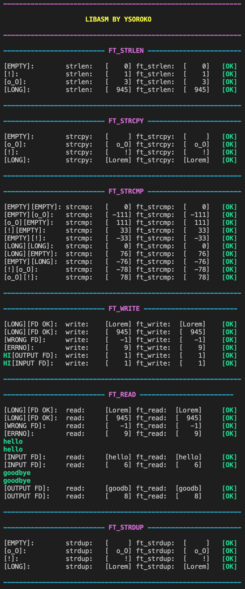

# Libasm
This project is an introduction to Assembly language.

It consists in recreating several basic C funcions from scratch using the Assembly.

Compiled using nasm with macho64 output format on MacOS.

My own unit test is used to:
- Compare the results of newly coded functions vs already existing C functions
- Checking that the functions set up the global variable "errno" accordingly after failed syscalls
- Checking that the strings are modified correctly when using "write" and "read" functions
- Checks the input / output file descriptors with write and read functions
 

### Try it:
#### ⚠️ Requires nasm compiler installed and macOS x64 Intel processor architecture
#### ⌨ Just download the project and run "Make test" in your terminal
#### ℹ️ The tester will wait for input after "ft_read" part. Input 2 same strings (under 10 characters), the result should say "[OK]"
 

### Use my Unit Test for this project:
#### Just replace my ".s" files by yours. Then run "Make test"

